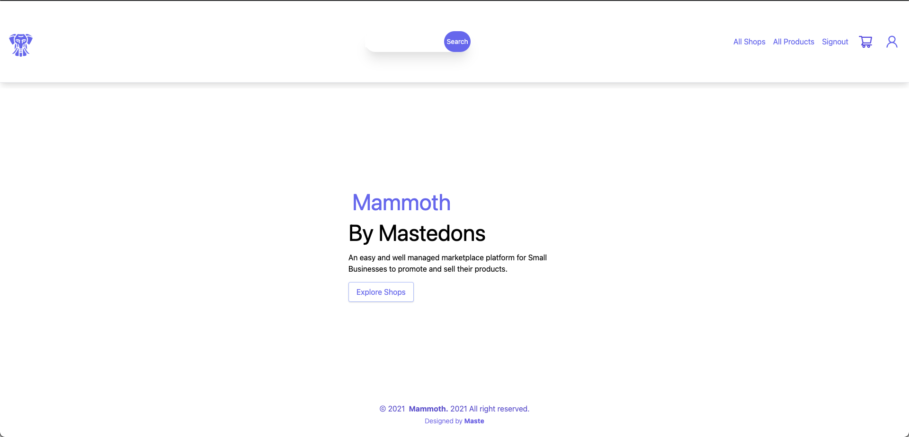
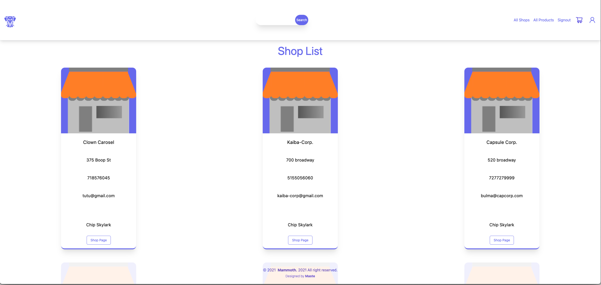
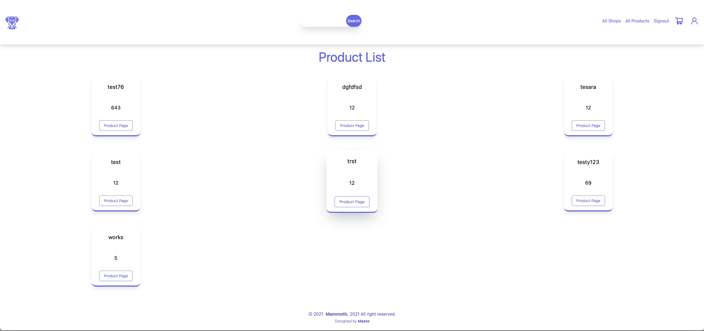
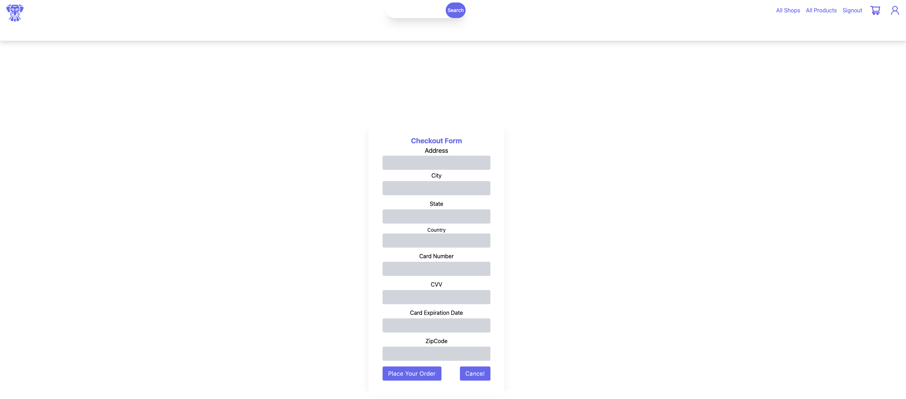
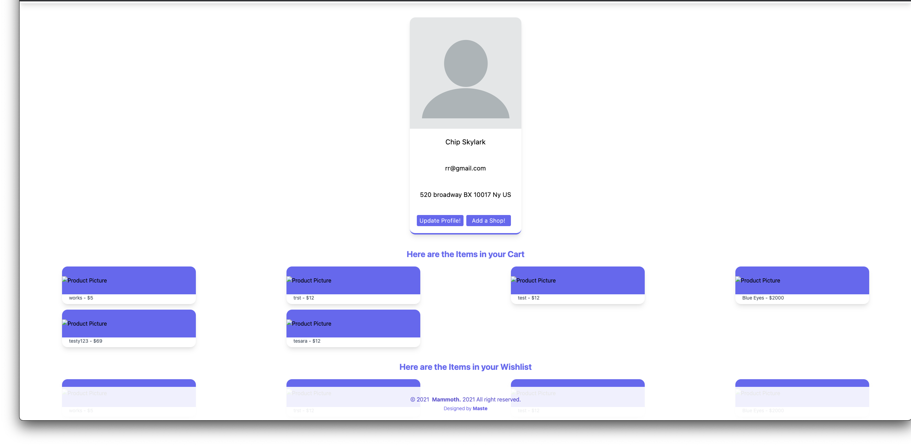
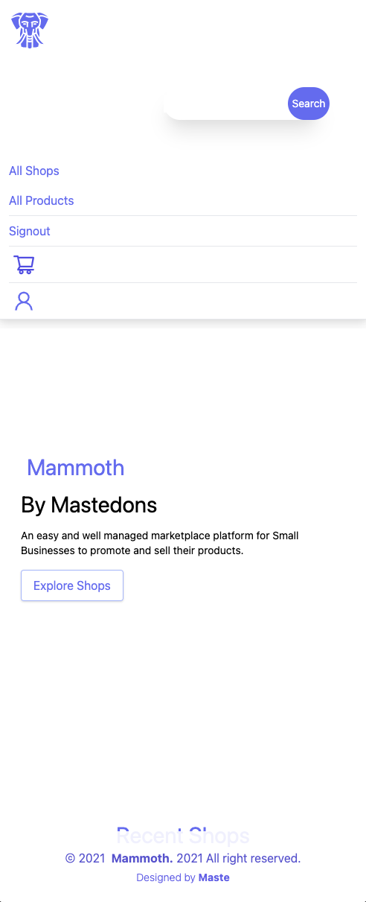

# Mammoth
## Introduction

## Instructions For Use

## Tech Framework
### This app uses:
* [React](https://reactjs.org/)
* [TailwindCSS](https://tailwindcss.com/)
* [Node.js](https://nodejs.org/en/) v 14.17.1 & [Express](https://expressjs.com/) v 4.17.1
* [dot env](https://www.npmjs.com/package/dotenv)
* [MongoDB](https://www.mongodb.com/cloud/atlas)
* [Mongoose](https://www.npmjs.com/package/mongoose)
* [JWT Web Token](https://jwt.io/)
* [Bcrypt](https://www.npmjs.com/package/bcrypt)
* CSS
* Javascript
  
## This app is hosted at: 
* [GitHub Repo](https://github.com/blakeromano/mammoth)
* [Heroku Hosted Site]()

## Planning Materials:
* [Trello Board](https://trello.com/b/Rw7YGhrT/mammoth-app)
* [Wireframes](https://whimsical.com/mammoth-7kYLPk2EHWqgCKz6Nno42C)
* [ERD](https://whimsical.com/mammoth-8esd3VHisxU4XMEGJHUydU)
## Ice Box Goals
* Better Styling
* Analytics for Shops on Shop Manager
* Show notifications for purchases, new messages, order updates, etc
* Be able to delete products for my shop
* Delete a store
* Delete a user/profile
* Be able to update password
* Have Admins for review/store moderation
* Have a smart search which will help a user search for products listed on the site
* Have recommendations based on previous orders
* Allow people to gift an item to you
* Specific pages for LGBT+, Black or Woman Owned Stores
* Able to filter stores
* Able to filter products
* Darkmode

## Contribute

At this point in time the developers are open to outside collaborators on Mammoth. That may change in the future as this project grows and scale issues require more skillsets and man-hours to build and maintain the platform.  If you believe in the mission of this product the best thing you can do is utilize the product, contribute code snippets, and help build our knowledgebase.

## Special Thanks

* Instructors (Ben Manley, Thiago Cavalcante, Jurgen Stevens, and Brian Krabec) and peers from the General Assembly SEIR-6-21 cohort for collaboration in developing this app.
* !!!Attributions go here!!!
* The code for this website was written with frequent reference to a number of 3rd party resources:
  * [CSS-Tricks](https://css-tricks.com/)
  * [Git-SCM](https://git-scm.com/docs)
  * [MDN Web Docs](https://developer.mozilla.org/en-US/)
  * [Mongoose Docs](https://mongoosejs.com/docs/guides.html)
  * [React Router Docs](https://reactrouter.com/core/guides/philosophy)
  * [Stack Overflow](https://stackoverflow.com/)

## About the Developers

### Blake Romano

Blake is a full stack web developer from the Boston, MA area, with a passion for animals, biology and technology. Blake decided to get into software development after finishing his associates degree. Learn more about Blake at these links:

* [LinkedIn](https://www.linkedin.com/in/blakeromano)
* [GitHub](www.GitHub.com/blakeromano)

### Nick Rodriguez

Blake is a full stack web developer from the NYC area, with a passion for food, culture and technology. Nick decided to get into software development after after a 5 years in the Hospitality Management Industry. Learn more about Nick at these links:

* [LinkedIn](https://www.linkedin.com/in/nicholas-r-rodriguez/)
* [GitHub](https://github.com/nrayrod1016)

## Screenshots

[Back to Top](#top)